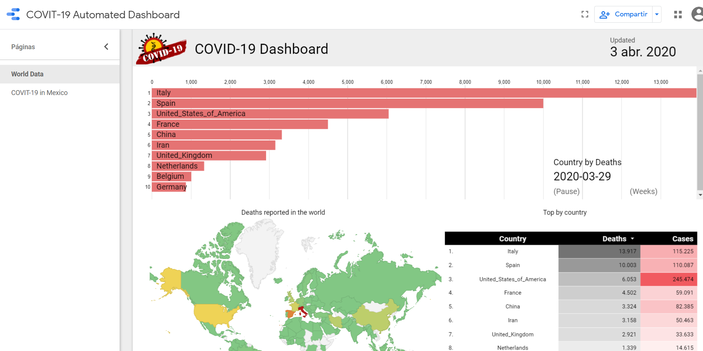
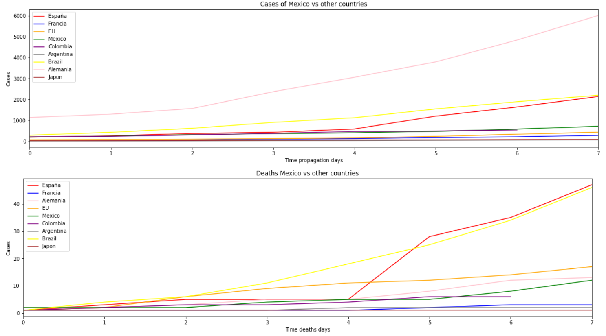
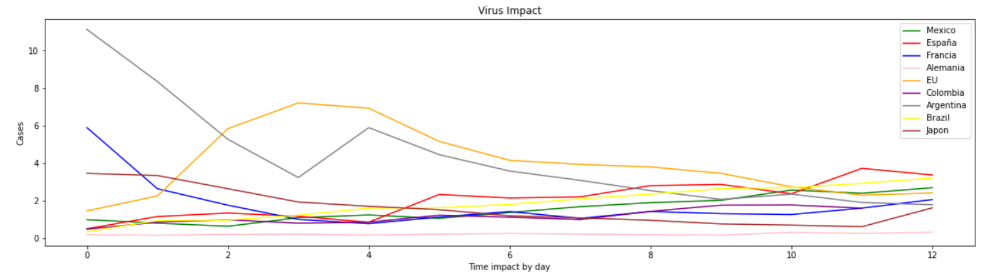
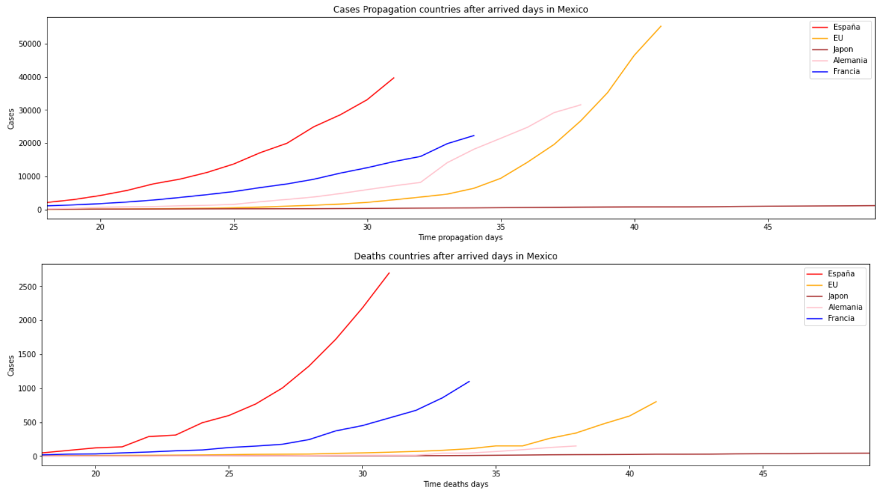
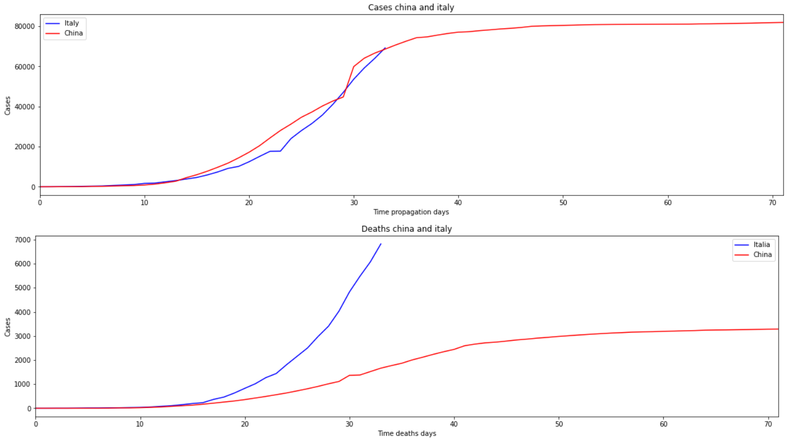

# COVIT-19 Analysis Dashboard <!-- omit in toc -->

<div align="center">
  
  <small><p>DataStudio Dashboard</p></small>
</div>

Analysis of public Datasets
- [Disclaimer](#disclaimer)
- [Versions](#versions)
- [V2 - Python, Google Sheets AND DataStudio](#v2---python-google-sheets-and-datastudio)
  - [Requirements and configurations](#requirements-and-configurations)
  - [How to run](#how-to-run)
  - [DEMO](#demo)
  - [Preview](#preview)
- [V1 - Notebook Description (deprecated)](#v1---notebook-description-deprecated)
  - [Considerations](#considerations)
  - [Requirements](#requirements)
  - [DEMO](#demo-1)
  - [Preview](#preview-1)
    - [Propagation day 0 so far](#propagation-day-0-so-far)
    - [Virus impact](#virus-impact)
    - [Virus propagation](#virus-propagation)
    - [Worse of cases](#worse-of-cases)
- [Tecnical Notes](#tecnical-notes)
  - [Jupyter Notebook](#jupyter-notebook)
  - [Colab](#colab)
- [How to contribute](#how-to-contribute)

# Disclaimer
The present notebook is for educational purposes

* You can send your contributions with a pull request or on twitter ``@eocode``

<div align="center">
  
</div>

# Versions

Manual
* Jupyter notebook AND Google COLAB

Automatized
* Python, Googhe Sheets AND DataStudio

# V2 - Python, Google Sheets AND DataStudio

## Requirements and configurations

Create a Google Cloud Project here: 
https://console.developers.google.com/

* Enable Drive API and generate json
* Enable Google Sheets API

Copy *.json to root app

On file main.py edit the name api.json for your file name and GSheets data

## How to run

run this command for install dependences

`python -m venv env`
`pip install -r requirements.txt`

Open your Google Sheets and Share with client_email inside on your file .json

run
```shell
python main.py
```

* Connect Dataset in Google Sheets to DataStudio

## DEMO

[DataStudio Dashboard](https://datastudio.google.com/reporting/9770b745-9af2-4967-aac7-66d01f043379/page/HW3KB)

## Preview
<div align="center">
  
  <small><p>Dashboard</p></small>
</div>

# V1 - Notebook Description (deprecated)
This repo contains a notebook with analisys of COVIT-19 propagation in Mexico and other countries

## Considerations
* Deaths in México start analysis
* Deaths start day 0
* Impact = Deaths / Cases `This detection dependence by country tests`

## Requirements
This repo is build with Jupyter Notebook and Anaconda/Python 3, for run open next file:

> COVIT-19 Analisys.ipynb

The notebook make this:
* Download the data
* Clean and Filter the data
* Analisys the data
* Visualize the data

## DEMO
https://colab.research.google.com/drive/1KsGxBwe0cNkQVemaM5HRax11025qNSmn#scrollTo=AIo7aJ2h1iS3

## Preview

### Propagation day 0 so far

<div align="center">
  
  <small><p>Mexico Propagation vs other countries</p></small>
</div>

<div align="center">
  
  <small><p>Data</p></small>
</div>

### Virus impact

Relationship cases and deaths

<div align="center">
  
  <small><p>Cases vs Deaths = Impact</p></small>
</div>

### Virus propagation

The best of cases is Japan tendency

<div align="center">
  
  <small><p>Propagation in other countries after days arrived Mexico</p></small>
</div>

<div align="center">
  
  <small><p>Data</p></small>
</div>

### Worse of cases

Compare China and Italy

<div align="center">
  
  <small><p>Worse of case</p></small>
</div>

---------------
# Tecnical Notes
## Jupyter Notebook

* Excecute commands
```jupyter
! pwd
```
* Cells Support markdown
* Export to LATEX, HTML, PDF, etc
* Cells operations, merge, add, edit, update, delete
* View metadata
* Find and replace data
* Kernel operations (Instance of python) interrupt, stop, restart ...

## Colab
* Snippets
* Execute Python and JS
* Dinamic Variables with forms
* Connect to local python kernel
* temporal code

# How to contribute

Send me a pull request with your changes or catact me on Twitter or Linkedin as **EOCode**